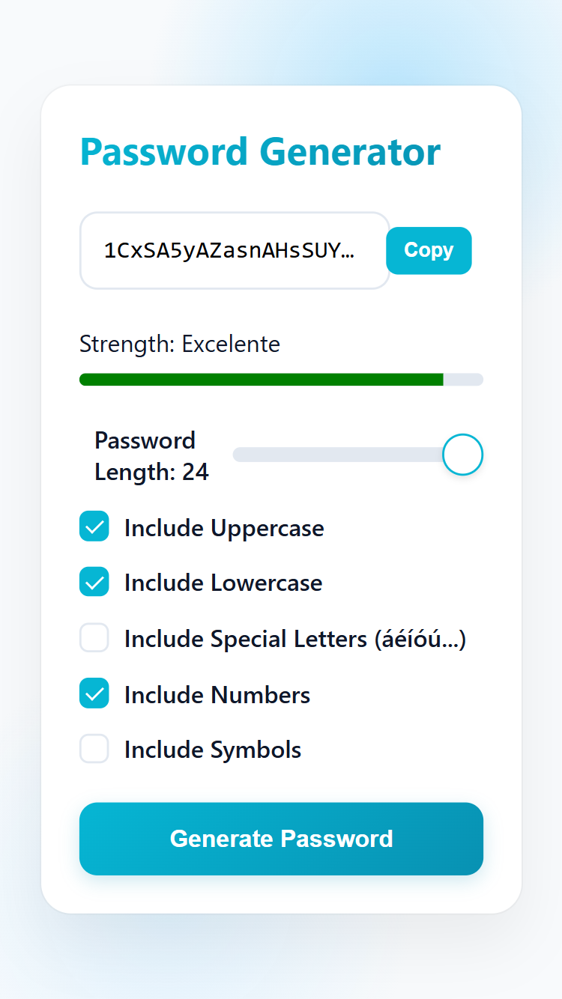
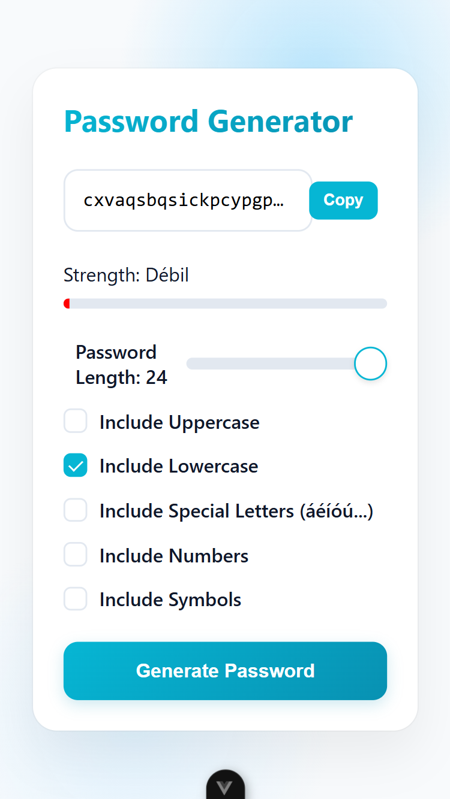

# React vs Vue: Password Generator Comparison

This project implements the same password generator application in both React and Vue to compare the two frameworks' approaches to building web applications.

## Overview

The password generator app allows users to:
- Generate random passwords with custom options
- Choose password length (8-24 characters)
- Include different character types (uppercase, lowercase, special letters, numbers, symbols)
- View password strength evaluation
- Copy generated passwords to clipboard

## Visual Comparison

  
  &nbsp; &nbsp; &nbsp; &nbsp;
  

  <em>React implementation &nbsp; &nbsp; &nbsp; Vue implementation</em>

## Key Framework Differences

### State Management

**React:**
- Uses Context API for global state management
- State is managed through the `PasswordContext` provider
- Components access state via `useContext` hook
- State updates propagate through provider to child components

**Vue:**
- Uses component-level state management with Vue's `data()` property
- State is directly managed within the component
- Reactive binding automatically updates UI when state changes

### Component Structure

**React:**
- JSX syntax for templating
- Components split into separate files
- Uses function components with hooks
- Component tree managed through explicit prop passing or context

**Vue:**
- Single File Components (SFC) with `<template>`, `<script>`, and `<style>` sections
- HTML-like template syntax
- Option API with methods, computed properties, and lifecycle hooks
- Component communication via props and events

### Event Handling

**React:**
- Explicit event handling with callback functions
- Event names use camelCase (e.g., `onClick`)
- State updates use setter functions from hooks

**Vue:**
- Directive-based event handling (`v-on:` or `@`)
- Two-way binding with `v-model`
- Method calls directly from template

### Styling

**React:**
- CSS imported into components
- Same CSS applied globally
- Component-specific styling through class names

**Vue:**
- Scoped CSS within components
- Style encapsulation with `<style scoped>`
- Global styles defined in App component
